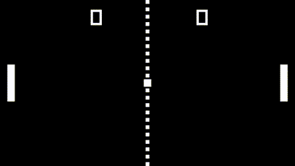

# Pong

This project is a clone of the classic game Pong, built using the raylib graphics library. It features a simple yet engaging gameplay where a player must hit the ball on the opposite side of the screen, while a computer tries doing the same to the player.




## How to Run

To run this game, ensure you have raylib installed on your system. You can compile the project using the provided Makefile (assuming you are on a platform that supports Make):

```bash
make
./pong